# 灵播 LingCast

<p align="center">
  
</p>

<p align="center"><a href="README.md">English</a> | <a href="README-zh.md">简体中文</a></p>

端到端 AI 数字人直播平台：创建数字人（形象 + 音色 + 人物设定）→ LivePortrait 生成
基础视频 → **Edge-TTS 语音 + Wav2Lip 口型** → **DeepSeek LLM 实时回复** → SRS 直播推流。

管理后台 `:8080` · 观众端 `:3000` · [架构文档](docs/技术需求与架构文档.md) ·
[Roadmap / TODO](docs/TODO.md) · [开发交接说明](AGENTS.md)

# Contents

- [为什么做](#为什么做)
- [功能特性](#功能特性)
- [界面截图](#界面截图)
- [架构](#架构)
- [快速开始](#快速开始)
- [使用说明](#使用说明)
- [配置](#配置)
- [API 参考](#api-参考)
- [目录结构](#目录结构)
- [常见问题](#常见问题)
- [生产注意事项](#生产注意事项)
- [参与贡献](#参与贡献)

## 为什么做

做口播数字人/直播，传统方案要么依赖昂贵的闭源 API，要么需要高端 GPU 与复杂的声音克隆
流水线。灵播的目标是：

- 创建数字人只跑**一次** LivePortrait 预处理，之后播报/直播都是轻量推理（Edge-TTS +
  Wav2Lip ONNX），零 GPU 也能用。
- 观众端开箱即用：游客/账号身份、持久化聊天、**DeepSeek LLM** 实时回复并开口说话。
- 部署友好：Docker Compose 一键起基础设施；真实 AI Worker 在宿主机原生跑
  （macOS MPS / Linux CUDA / AMD ROCm）。

## 功能特性

- [x] **Avatar Studio（创建）**：形象名称 + 头像展示 + 图片上传 + Edge-TTS 音色选择
  （列表缓存于 localStorage，默认中文女声晓晓），可填**人物设定**（年龄/身高/体重/
  族裔/感情状态/性格），提交后显示「基础视频生成中…」并轮询状态。
- [x] **数字人编辑**：数字人列表卡片「编辑」跳转到 Avatar Studio（`?edit=<id>`）预填
  信息，保存即 PUT 更新（形象图片不更换）；删除用系统 AlertDialog 确认。
- [x] **管理员账号**：登录后可在「账号设置」修改显示名字与密码（持久化到 `admin_users`
  表，重启不丢）。
- [x] **Broadcast（离线播报）**：选择已就绪数字人 + 输入脚本 → 提交任务 → 轮询 →
  状态卡片内嵌 **xgplayer** 播放成品（9:16 竖版，最大 720×1080，模态窗播放）。
- [x] **客户端直播间（观众端）**：独立 Next.js + TailwindCSS 项目（`frontend-user/`，端口
  **3000**，不属于管理后台）：首页有导航头（游客/账号身份、注册/登录/退出）与
  **分类筛选**，列出所有开播机器人（`GET /api/live`）；进入 `/rooms/:avatarId`
  后 xgplayer 拉 HTTP-FLV 观看，聊天面板按用户展示 `用户名 #ID`，可直接向数字人
  发消息（`POST /api/live/:id/message`）。`/api` 与 `/live` 由 Next 路由处理器在
  服务端代理，浏览器无 CORS 负担。
- [x] **抖音式直播间**：桌面端左侧画面铺满 + 模糊背景、9:16 视频居中、右侧聊天固定
  400px；手机端全屏（隐藏导航）、返回与主播头像覆盖在画面上、胶囊消息 + 覆盖式
  输入框、点赞爱心动画；聊天支持智能滚动（上翻历史不抢滚动，出现「有新消息」按钮）。
- [x] **聊天身份与记录持久化**：游客自动分配临时 ID+用户名（`POST /api/chat/guest`）；
  注册把当前游客身份原地升级为账号（聊天记录不丢），登录把游客消息合并进账号，
  退出后重新获取新游客身份。用户消息与机器人回复全部入库（`chat_users` /
  `chat_messages`），`GET /api/chat/history` 供两端拉取历史。
- [x] **直播字幕配置**：每个数字人可在 Live Studio「字幕设置」里配置是否显示字幕、
  字体（`worker/fonts/` 下的文件名）、位置（顶部/底部）、描边宽度与字号，持久化为
  Avatar 的 JSON 字段 `live_settings`；保存后自动重启直播生效。
- [x] **管理端用户列表**：侧边栏「用户相关 → 用户列表」展示全部聊天用户
  （游客/账号 + 消息数），数据来自 `GET /api/users`。
- [x] **亮/暗主题**：管理端默认暗色（含白色版 logo），观众端导航头可切换亮/暗并记忆。
- [x] **悬浮画面监看**：Live Studio 右下角圆形 FAB，点击弹出可拖动的 9:16 视频浮窗，
  默认不渲染播放器，按需开启。
- [x] **LLM 消息回复**：客户端消息 → OpenAI Go SDK 调 DeepSeek Responses API
  （`base_url=https://api.deepseek.com`，模型 `deepseek-v4-flash`）→ 回复按句切块
  入直播队列 → TTS → 口型 → 推流；未配置 `OPENAI_API_KEY` 时原样回读输入（测试模式）。
  创建时的人物设定会作为**内置提示词**注入，观众问年龄/身高/感情状态等时按设定回答。
- [x] **Edge-TTS 语音合成**：GPU-free 云端神经音色，按 avatar 的 `voice_id` 选声，
  一条句子约 1-2 秒。
- [x] **LivePortrait 基础视频预处理**：创建数字人时生成静音 24fps 驱动视频，仅此一次。
- [x] **Wav2Lip(ONNX) 口型合成**：基于预生成 base 视频，嘴部逐帧匹配语音；ONNX +
  CoreML 执行器，CPU 线程数受限（默认 4），短 base 自动循环覆盖任意脚本长度。
- [x] **动画节奏可调**：驱动模板可换、播放速度/动作幅度可调（见「配置」中的
  `LIVEPORTRAIT_DRIVING*` 参数）。
- [x] **基础视频去眨眼**：驱动模板眼部表情通道已冻结（不眨眼），保留耸肩/身体微晃，
  约 3 秒一次（`LIVEPORTRAIT_DRIVING_SPEED=0.2`）。
- [x] **数字人分类**：Avatar 创建时可选「直播分类」（闲聊/知识/娱乐/游戏/带货/其他），
  观众端首页按分类筛选直播。
- [x] **国际化（中/英）**：管理后台与观众端均内置中/英界面，导航栏可一键切换
  （记住选择并自动跟随浏览器语言）；后端错误消息按请求 `Accept-Language` 返回
  对应语言；直播间 AI 按界面语言回复。
- [x] **人脸修复（解决 Wav2Lip 口型变形）**：双轨增强器（`worker/ai/enhancer.py`）——
  离线播报用 CodeFormer ONNX（保真度 `w=0.6`）全脸修复（默认开启），直播链路用
  GFPGANv1.4 ONNX 只修复人脸 ROI + 羽化遮罩（**直播管线完全不用人脸增强**——
  Watchdog 架构要求恒定 24fps，GFPGAN 在 Apple Silicon CoreML 约 1s/帧）。
  纯 ONNX 推理（CoreML/CUDA/ROCm）；离线效果已验证（见下方对比视频）。
- [x] **Watchdog 直播架构（不再转圈）**：独立写帧线程以恒定 24fps 推给 ffmpeg，
  消费 Ready 帧队列；Wav2Lip 还在产帧时立即回退 base 动画 + 静音，播放器
  永不掉线/缓冲。推理异步小批量（8 帧）产帧，连续句子无缝拼接。
- [x] **私有知识库 + 长期记忆（本地 RAG，零模型）**：两级模型
  数字人 → 知识库（Collection）→ 文档（Document）。独立的 `rag-service`
  微服务（FastAPI + uv + [zvec](https://zvec.org) 进程内全文索引）用自带
  Jieba 中文分词——**不需要 sentence-transformers / torch / 模型下载，
  也不需要 RediSearch**。文档（粘贴文本或上传 .txt/.pdf）按 ~300 字 /
  50 字重叠切块并按知识库建索引；直播问答注入最近 10 条房间消息 +
  按数字人聚合的 Top-3 知识，严格按知识库回答、未知才说不知道。
- [x] **知识库管理界面**：`/knowledge` 知识库列表（创建/重命名/删除，知识库
  归属数字人），`/knowledge/$id` 管理知识库内的文档（文本/.txt/.pdf、删除、
  查看分块），支持按知识库做 Top-3 检索测试。
- [x] **Edge-TTS 微服务**（`tts-service/`，Docker 内网 :8002）：async
  `edge_tts.Communicate` → ffmpeg → **16kHz / 16-bit / 单声道 PCM WAV**
  （Wav2Lip 下游要求的确切格式）→ 上传 S3（RustFS）→ 只返回 S3 key + 元数据；
  `finally` 清理临时文件，S3 配置全部来自环境变量。
- [x] **聊天日志页**：`/chat-logs` 按数字人/用户 ID/日期/关键字检索 + 分页；
  机器人回复标注「命中知识库」并可展开查看命中的知识片段。
- [x] **观众端用户中心**：`/account` 展示游客/账号身份，支持注册/登录/退出与
  「我的消息」（跨房间）；首页增加 Hero CTA、卡片悬停进入直播间、页脚账号入口。
- [ ] **Mock 管线**（`AI_MODE=mock`）：轻量占位，供 Docker Worker 镜像演示。

## 界面截图

**管理后台（灵播）**

| | | |
| --- | --- | --- |
| 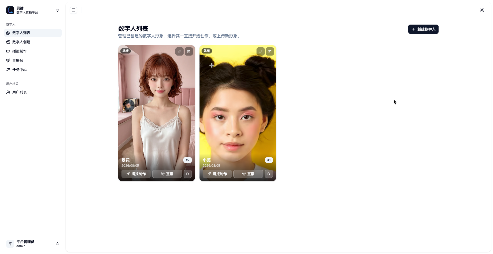 | 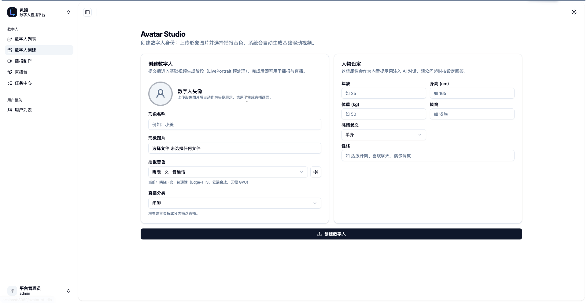 | 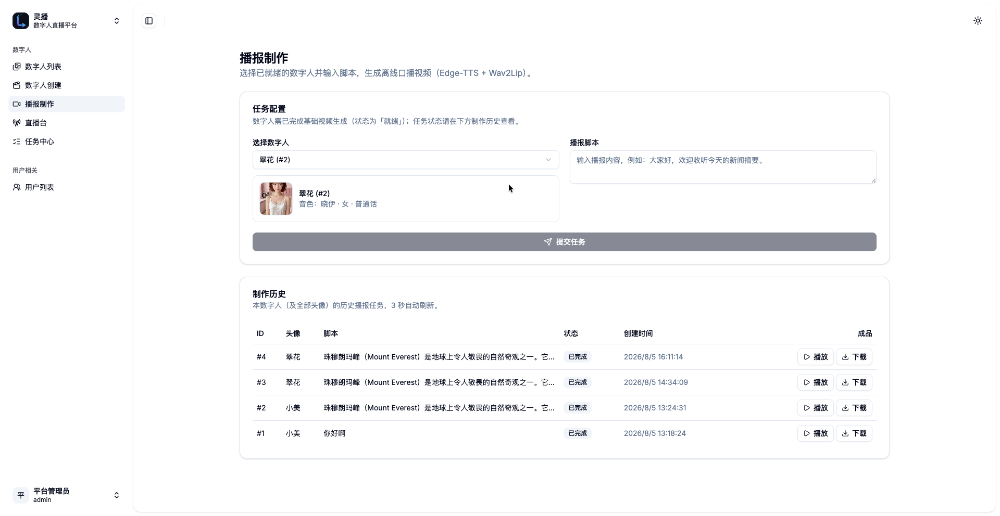 |
| 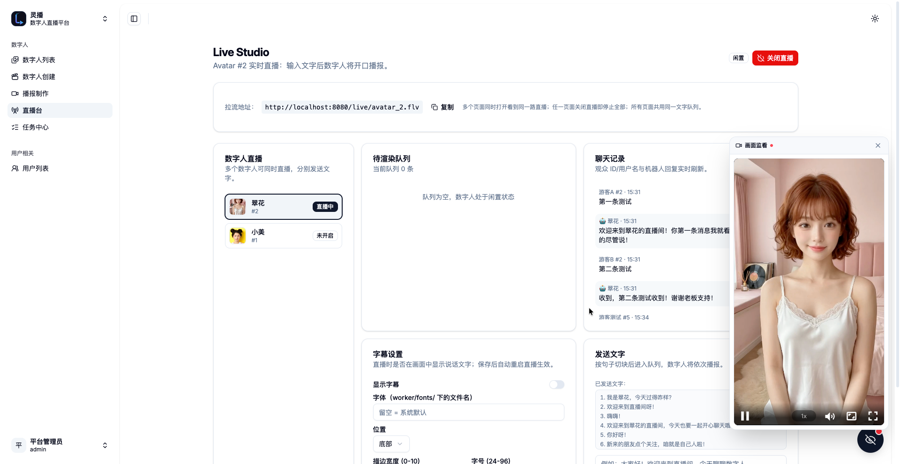 | 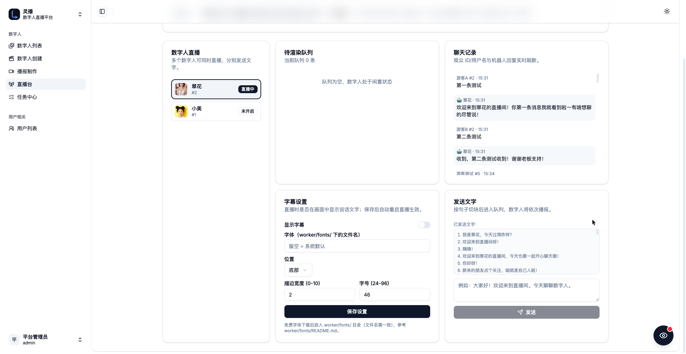 | 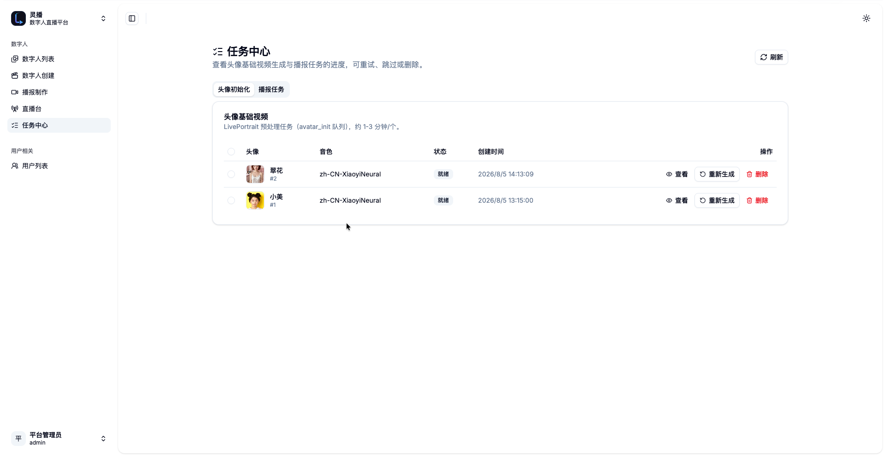 |
| 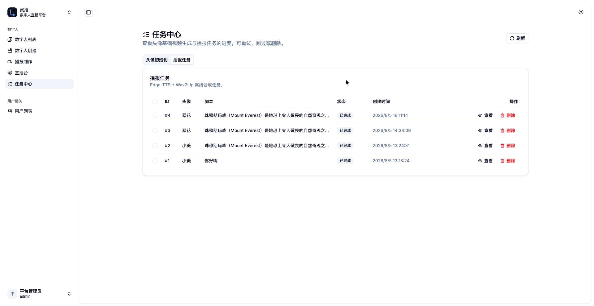 | 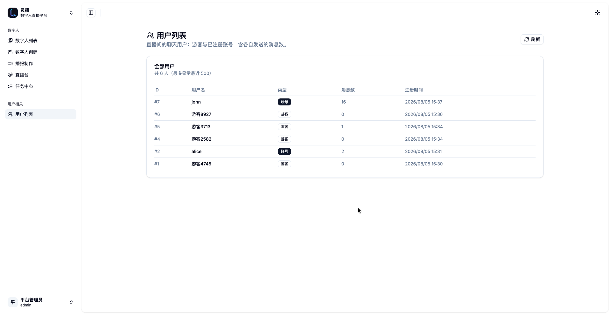 | 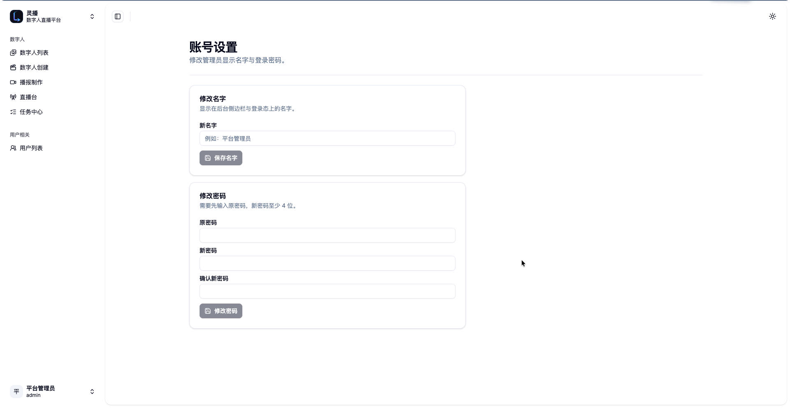 |

**观众端（灵播）**

| | | |
| --- | --- | --- |
| 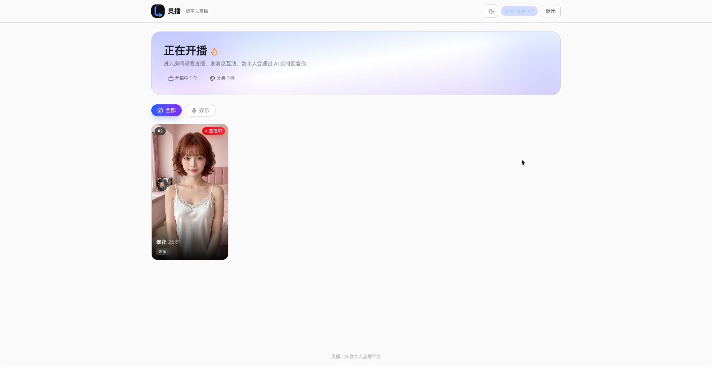 | 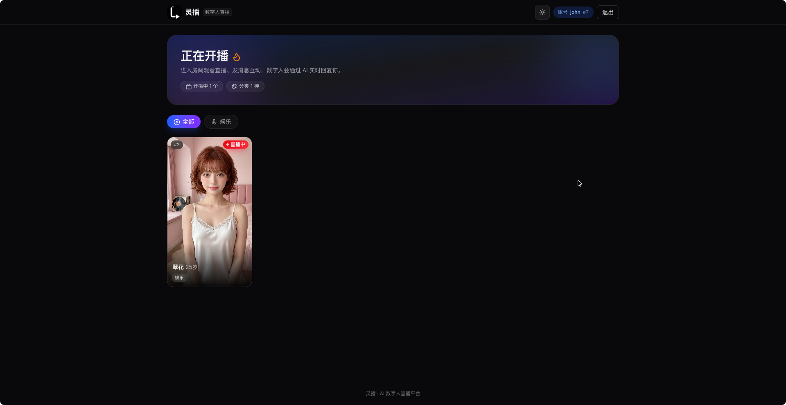 | 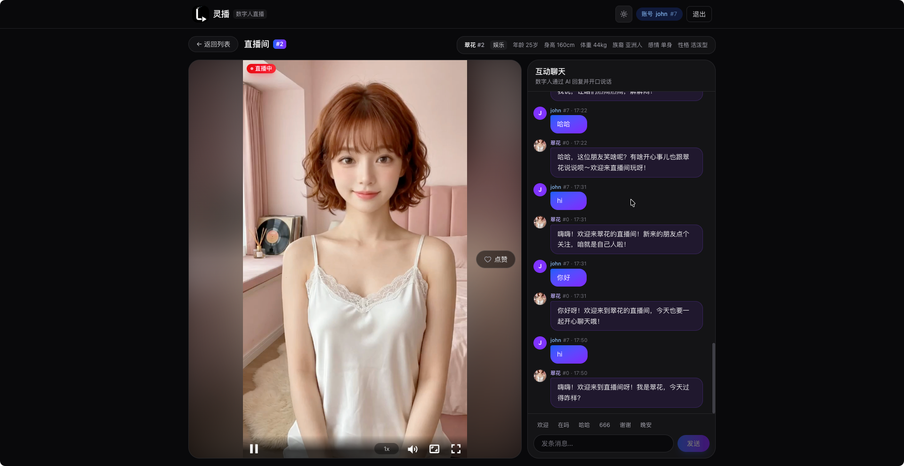 |
| 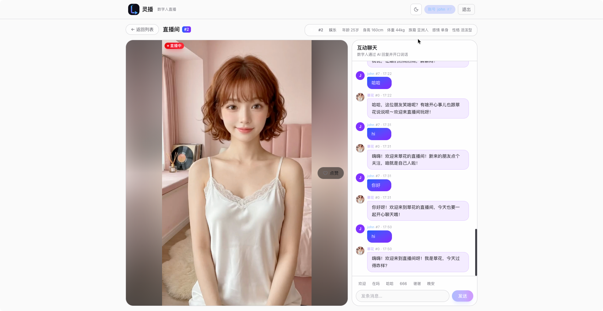 |  | |

## 人脸修复效果对比

离线播报在开启/关闭 CodeFormer 人脸修复下的成品对比（同一脚本、同一数字人，
重点看下巴与嘴部区域；离线默认开启，`FACE_ENHANCER=off` 可关闭）：

| 未开启 CodeFormer | 开启 CodeFormer |
| --- | --- |
|  |  |
| [▶ 下载 MP4](docs/videos/noCodeFormer.mp4) | [▶ 下载 MP4](docs/videos/CodeFormer.mp4) |

## 架构

```text
管理后台 :8080 ──> Nginx (frontend)
  ├── /api    ──> api-admin (Gin) ──> MariaDB 11 / Redis 8.2 / RustFS / rag-service
  └── webhooks ──> api-scheduler（Worker 任务/基础视频回调）
  └── /media  ──> RustFS (S3 兼容)

观众端 :3000 ──> Next.js（服务端代理 /api、/live）──> api-user / SRS

Python AI Worker ──> Redis 队列 / boto3 下载素材
                  ──> 创建: LivePortrait 生成 base 视频（一次性预处理）
                  ──> 使用: Edge-TTS → Wav2Lip(ONNX) 离线播报 / 直播推流
                  ──> 上传成品到 S3, 通过 Webhook 回写任务状态

rag-service ──> zvec 进程内全文索引（Jieba 中文分词，零模型）
             ──> Go API 直连 /v1/knowledge/{ingest,search,delete,chunks}

tts-service ──> async edge-tts → 16kHz PCM WAV → S3（RustFS）
             ──> POST /v1/tts/synthesize 只返回 S3 key（媒体不过 HTTP）
```

- 管理端前端：React + TypeScript + Vite + Tailwind + shadcn/ui（品牌「灵播
  LingCast」，默认暗色主题，可切换亮色；需管理员登录）。
- 观众端前端：独立 Next.js 16 + TailwindCSS 4（`frontend-user/`，亮/暗双主题可切换，
  无需登录）。
- 后端：Go + Gin + GORM，拆分为三个微服务（同一 module 共享 internal 包）——
  `api-admin`（管理端，:8081）、`api-user`（观众端/直播聊天，:8082）、
  `api-scheduler`（Worker 回调，:8083）；标准 AWS S3 SDK v2。
- AI Worker：Python 3.11，uv 管理依赖，boto3 + Redis。
- 知识库微服务：`rag-service`（FastAPI + uv + zvec FTS，Jieba 分词，零模型依赖，
  Docker 内网 8001，数据持久化在 volume `rag-zvec-data`）。
- 存储：S3 兼容对象存储（开发环境直接运行 RustFS）。
- 部署：Docker Compose 编排基础设施与前端；**真实 AI Worker 在宿主机原生运行**
  （macOS Apple Silicon 用 MPS/CoreML，Linux 用 NVIDIA CUDA 或 AMD ROCm），
  宿主机仅开放必要端口：**3000**（观众端）、**8080**（管理端/API）、**1935**
  （RTMP 推流）、**6379**（Redis）与 **9000**（RustFS）；`api-admin`、
  `api-user`、`api-scheduler`、`rag-service`、`tts-service` 均在内网，不开放
  宿主端口。

## 快速开始

### 0. 前置依赖

- Git、Docker Desktop（或 Docker Engine + Compose）
- Python 3.11 + [uv](https://docs.astral.sh/uv/)
- 宿主机 macOS 需要 FFmpeg：`brew install ffmpeg`
- 前端开发需要 pnpm 10：`npm i -g pnpm@10`
- 后端开发需要 Go 1.22+

### 1. 克隆并启动 Docker 服务

```bash
git clone https://github.com/taochangle/LingCast.git && cd LingCast
cp .env.example .env
docker compose up --build
```

访问 <http://localhost:8080>，左侧菜单进入 **Avatar Studio**。

> **Note**：管理后台需要登录后才能访问（默认 `admin` / `admin123`，请在 `.env` 中
> 修改 `ADMIN_USERNAME` / `ADMIN_PASSWORD` 并重启 API 容器）。观众端（:3000）不受
> 影响，仍可直接进入直播间。

### 2. 准备 Worker 环境（uv）

```bash
cd worker
uv venv                    # 按 .python-version 使用 CPython 3.11
uv sync --all-groups       # 安装全部依赖（含 PyTorch MPS、LivePortrait、Wav2Lip）
cp .env.local.example .env.local
```

> 约定：所有 Python 命令一律通过 `uv run python ...` 执行（在 `worker/` 目录下），
> 不要直接调用系统 `python`/`python3`，也不要使用 `requirements.txt`——依赖统一由
> `pyproject.toml` + `uv.lock` 管理，新增依赖用 `uv add`。

### 3. 准备模型（二选一）

**方式 A：新设备下载（约 4GB，需要网络）**

```bash
cd worker
uv run python download_models.py --models all
```

脚本会克隆 LivePortrait / Wav2Lip 代码到 `worker/external/`，下载权重到
`worker/models/`（两者均已 gitignore），并自动完成：把 wav2lip_gan.pth 本地导出为
ONNX（约 145MB）、下载 SCRFD 人脸检测 ONNX（约 3MB）。

- 国内网络加速：`HF_ENDPOINT=https://hf-mirror.com uv run python download_models.py`
- GitHub 慢时走代理：`git config --global http.proxy http://127.0.0.1:7897`

**方式 B：从旧设备拷贝（最快）**

把旧机器的 `worker/models/` 与 `worker/external/` 两个目录整体拷贝到新机器对应
位置即可，`download_models.py` 会自动跳过已存在的文件。

### 4. 启动 Worker（真实管线）

```bash
cd worker
uv run python -u worker.py           # 离线播报 / 创建预处理
uv run python -u stream_worker.py    # 实时直播（与 worker.py 并存）
```

`worker.py` 自动加载 `worker/.env.local`（已导出的环境变量优先）。`AI_MODE=real`
时跑真实模型管线；模型缺失时会有明确提示。

### 5. 本地前端开发

```bash
# 管理端（Vite，端口 5173）
cd frontend
cp .env.example .env.local   # VITE_API_BASE_URL=http://localhost:8080
pnpm install
pnpm dev

# 观众端（Next.js，端口 3000）
cd client
pnpm install
pnpm dev
```

### Linux + AMD Radeon 部署（ROCm，如 RX 6800 XT）

6800 XT 是 RDNA2（gfx1030），ROCm 6.x / 7.x 均支持。两种方式任选：

**方式 A：官方 ROCm PyTorch 容器（推荐，torch 已预装）**

```bash
docker run -it --rm --network=host --ipc=host \
  --device=/dev/kfd --device=/dev/dri --group-add video \
  -v /path/to/LingCast:/workspace -w /workspace/worker \
  rocm/pytorch:rocm7.14_ubuntu24.04_py3.13_pytorch_release_2.12.0 bash
```

容器内（Python 3.13，torch 2.12 ROCm 已就绪）：

```bash
pip install uv ffmpeg        # 容器通常缺 uv 与 ffmpeg
uv sync --all-groups --no-group cuda --python python3 --inexact
cp .env.local.example .env.local
uv run python -u worker.py
```

> **Warning**：`--inexact` 很重要——镜像预装的 torch 不在 lock 里，不加这个参数
> `uv sync` 会把 torch 剪掉。`--network=host` 让容器直接访问宿主机的 Redis/RustFS。

**方式 B：裸机 Ubuntu + ROCm**

```bash
cd worker
uv sync --all-groups --no-group cuda
uv pip install torch torchvision torchaudio \
  --index-url https://download.pytorch.org/whl/rocm6.3
# 以后每次 uv sync 都要加 --inexact，否则上面手动装的 torch 会被移除
```

验证：`uv run python -c "import torch; print(torch.cuda.is_available(), torch.version.hip)"`

**Worker 环境变量（`worker/.env.local`）**

```bash
AI_MODE=real
LIVEPORTRAIT_DEVICE=cuda
WAV2LIP_PROVIDER=rocm    # ROCm EP 不支持 LSTM 时会自动逐算子回退 CPU，不影响正确性
```

> 如果 ROCm EP 在你的卡上有问题，`WAV2LIP_PROVIDER=cpu` 同样可用（CPU 推理本身
> 就有 35fps+）。

## 使用说明

### 创建数字人

管理后台 → **Avatar Studio**：上传形象图片、选择音色与分类、填写人物设定 → 创建后
自动进入基础视频生成（LivePortrait 预处理，约 1-2 分钟），就绪后即可用于播报/直播。

### 离线播报

**Broadcast**：选数字人 + 输入脚本 → 提交任务 → 制作历史里查看进度并播放/下载成品
（9:16 MP4，Edge-TTS + Wav2Lip 合成）。

### 实时直播

**Live Studio**：开启直播后数字人进入常驻推流（闲置态播放基础动画）；直播台可发文字
测试，观众端发消息会走 **DeepSeek LLM** 回复并开口说话。字幕可在「字幕设置」按数字人
配置（开关/字体/位置/边框/字号，字体放 `worker/fonts/`）。

```bash
# 命令行示例
curl -X POST http://localhost:8080/api/live/9/start
curl -X POST http://localhost:8080/api/live/9/message \
  -H 'Content-Type: application/json' \
  -d '{"text": "你好，在吗？"}'
curl http://localhost:8080/api/live/9/status
```

播放地址：`http://localhost:8080/live/avatar_9.flv`（前端用 xgplayer + flv 插件拉流）。

### 观众端

打开 <http://localhost:3000>：首页按分类筛选开播数字人 → 进入直播间（桌面左右布局 /
手机全屏抖音式）→ 游客可直接发消息，注册/登录后聊天记录跟随账号。

## 配置

| 参数 | 位置 | 说明 |
| --- | --- | --- |
| `AI_MODE` | `.env` / `.env.local` | `mock`（Docker 默认）或 `real`（宿主机） |
| `S3_*` | `.env` / `.env.local` | 对象存储端点、凭据、桶名、公网前缀 |
| `REDIS_*` | `.env` / `.env.local` | Redis 地址、密码、队列 Key |
| `REDIS_IMAGE` | `.env` | Redis 镜像（默认 `redis:8.2.2-alpine`） |
| `EMBED_SERVER_URL` | `.env` | 知识库检索服务地址（默认 `http://rag-service:8001`，Docker 内网） |
| `LIVEPORTRAIT_DEVICE` | `worker/.env.local` | `mps`（macOS 默认）/ `cuda`（Linux）/ `cpu` |
| `LIVEPORTRAIT_DRIVING*` | `worker/.env.local` | 模板、速度、幅度 |
| `LIVEPORTRAIT_OUTPUT_FPS` | `worker/.env.local` | base 视频帧率（默认 24） |
| `WAV2LIP_PROVIDER` | `worker/.env.local` | `coreml`（macOS 默认）/ `rocm`（AMD）/ `cuda` / `cpu` |
| `WAV2LIP_THREADS` | `worker/.env.local` | ONNX 线程数上限（默认 4） |
| `WAV2LIP_BACKEND` | `worker/.env.local` | `onnx`（默认）/ `torch`（慢，对照） |
| `OPENAI_BASE_URL` | `.env` | LLM 端点（默认 `https://api.deepseek.com`） |
| `OPENAI_API_KEY` | `.env` | DeepSeek API Key；不设则消息原样回读 |
| `OPENAI_MODEL` | `.env` | Responses 模型（默认 `deepseek-v4-flash`） |
| `ADMIN_USERNAME` / `ADMIN_PASSWORD` | `.env` | 管理后台登录账号（默认 admin/admin123） |
| `STREAM_SUBTITLE_FONT` | `worker/.env.local` | 字幕回退字体（未配或字体缺失时用） |

完整清单见 `worker/.env.local.example`。动画节奏调整（驱动模板/速度/幅度）见
`LIVEPORTRAIT_DRIVING*` 注释与 `worker/.env.local.example`。

## API 参考

| 方法 | 路径 | 说明 |
| --- | --- | --- |
| `POST` | `/api/avatars` | multipart 上传 `name` + `image`(必填) + `voice_id`(可选) + `category` |
| `GET` | `/api/avatars` | 素材列表 |
| `GET` | `/api/avatars/:id` | 单个素材（含 `liveSettings`） |
| `PUT` | `/api/avatars/:id` | 编辑名称/分类/音色/人物设定 |
| `DELETE` | `/api/avatars/:id` | 删除数字人（级联任务/会话/文件） |
| `POST` | `/api/avatars/:id/retry` | 重新生成基础视频 |
| `PUT` | `/api/avatars/:id/live-settings` | 保存直播字幕等配置（JSON） |
| `POST` | `/api/avatars/:id/knowledge-collections` | 创建知识库（归属数字人，`{"name": ...}`） |
| `GET` | `/api/knowledge-collections` | 知识库列表（`avatarId` / `q` 筛选，含文档数） |
| `PUT` | `/api/knowledge-collections/:id` | 重命名知识库 |
| `DELETE` | `/api/knowledge-collections/:id` | 删除知识库（级联文档与索引） |
| `GET` | `/api/knowledge-collections/:id/documents` | 知识库文档列表 |
| `POST` | `/api/knowledge-collections/:id/documents` | 添加文档：`text` 或 `.txt/.pdf`（直连 rag-service 建索引） |
| `DELETE` | `/api/knowledge-collections/:id/documents/:did` | 删除文档（含索引） |
| `POST` | `/api/knowledge-collections/:id/documents/:did/chunks` | 查看文档分块 |
| `POST` | `/api/knowledge/search` | 在线检索测试（`avatarId` 或 `collectionId`，Top-3） |
| `POST` | `/v1/tts/synthesize` | `{text, voiceId}` → 16kHz PCM WAV 上传 S3，返回 `{s3_key, metadata}`（tts-service，内网） |
| `POST` | `/api/tasks` | `{avatarId, scriptText}`，入队并返回任务 |
| `GET` | `/api/tasks/:id` | 轮询任务状态与输出 URL |
| `POST` | `/api/tasks/:id/status` | Worker 内部 Webhook（processing/completed/failed） |
| `POST` | `/api/live/:id/start` | 开启直播（登记会话 + 通知 Worker 开管道） |
| `POST` | `/api/live/:id/stop` | 关闭直播 |
| `POST` | `/api/live/:id/message` | 聊天消息 → LLM 回复切句入队（观众端用） |
| `POST` | `/api/live/:id/push` | 直接按句入队（直播台测试用） |
| `GET` | `/api/live/:id/status` | 会话状态与队列 |
| `GET` | `/api/live` | 当前开播机器人列表 |
| `POST` | `/api/chat/guest` | 获取临时游客身份（userId + username） |
| `POST` | `/api/chat/register` | 注册（升级当前游客行，保留历史） |
| `POST` | `/api/chat/login` | 登录（合并游客消息进账号） |
| `GET` | `/api/chat/history` | 房间持久化聊天记录（`?avatarId=`） |
| `GET` | `/api/chat/logs` | 管理端聊天日志：`avatarId`/`userId`/`date`/`q` + `page`/`pageSize`，含 `ragHit` + `ragSources` |
| `GET` | `/api/users` | 用户列表（游客/账号 + 消息数） |
| `POST` | `/api/admin/login` | 管理员登录（HttpOnly cookie 会话） |
| `GET` | `/api/admin/me` | 当前管理员（username + name） |
| `POST` | `/api/admin/logout` | 退出登录 |
| `POST` | `/api/admin/change-name` | 修改管理员显示名字 |
| `POST` | `/api/admin/change-password` | 修改管理员密码（需原密码） |

> 管理端写操作与 `/api/users`、`/api/admin/*`（除 login/me/logout）需要登录态；
> 观众端接口（直播/聊天/拉流）与 Worker Webhook 保持公开。

## 目录结构

```text
LingCast/
├── backend/        Go module — 三个微服务：cmd/api-admin、cmd/api-user、
│                   cmd/api-scheduler（共享 internal/ 包）
├── rag-service/    本地 RAG 微服务（FastAPI + uv + zvec FTS/Jieba，:8001）
├── tts-service/    Edge-TTS 微服务（FastAPI + uv + edge-tts + ffmpeg，:8002）
├── frontend-admin/ 灵播管理后台（React + shadcn/ui，:8080）
│   └── public/images/  品牌 logo（暗/亮）+ favicon
├── frontend-user/  Next.js 观众端（独立项目，:3000）
│   ├── lib/        聊天身份（identity.tsx）/ 主题（theme.tsx）
│   └── public/     logo.svg + logo-white.svg
├── worker/         Python 3.11 AI Worker（uv、Redis、boto3）
│   ├── ai/         base/mock/real 管线、TTS、渲染、ONNX 口型
│   ├── fonts/      字幕字体目录（gitignore，见 fonts/README.md）
│   ├── external/   gitignore：LivePortrait / Wav2Lip 克隆代码
│   ├── models/     gitignore：全部权重（LivePortrait / Wav2Lip ONNX）
│   └── streaming/  ffmpeg 管道 + Pillow 字幕渲染
├── docs/           架构文档 + Roadmap（TODO.md）+ 界面截图（images/）
├── docker-compose.yml / .env.example
└── AGENTS.md       开发交接说明（新设备快速接手）
```

## 常见问题

- **任务一直 processing**：看 `worker` 日志尾部。口型阶段卡住通常是模型缺失，跑
  `cd worker && uv run python download_models.py --models wav2lip` 补齐。
- **GitHub/HF 下载慢**：GitHub 走代理，HF 用 `HF_ENDPOINT=https://hf-mirror.com`。
- **口型 CPU 打满/极慢**：确认 `WAV2LIP_BACKEND` 为 `onnx`（torch 版仅作对照）。
- **视频无声音**：成品由 Wav2Lip 阶段 mux Edge-TTS 语音；若用 mock 管线则以其
  离线 TTS 为音轨。
- **直播推流没画面**：先确认 `docker compose up` 里 srs 健康、`/live/<id>.flv`
  可拉流；ffmpeg 日志在 `stream-<id>/ffmpeg.log`。

## 生产注意事项

- 开发环境直接运行 RustFS 并开放 bucket 公开读（便于浏览器播放）。生产应改用
  真实 RustFS + 私有 bucket + 预签名 URL，调整 `S3_PUBLIC_BASE_URL` 与 nginx
  `/media` 代理。
- 生产环境请收紧 Worker 回调 Webhook 的鉴权。
- Linux/CUDA 生产部署需替换 PyTorch 为 CUDA 版（见 `worker/pyproject.toml` 注释），
  Wav2Lip ONNX 可在 NVIDIA 上用 `WAV2LIP_PROVIDER` 选择 GPU provider。

## 参与贡献

- 架构与演进方向见 [docs/TODO.md](docs/TODO.md) 与 [架构文档](docs/技术需求与架构文档.md)。
- 开发约定见 [AGENTS.md](AGENTS.md)（新设备快速上手、目录速览、已知坑）。
- 提交信息沿用仓库现有风格：`feat:` / `fix:` / `docs:` / `refactor:` 前缀 + 中文或
  英文描述。
